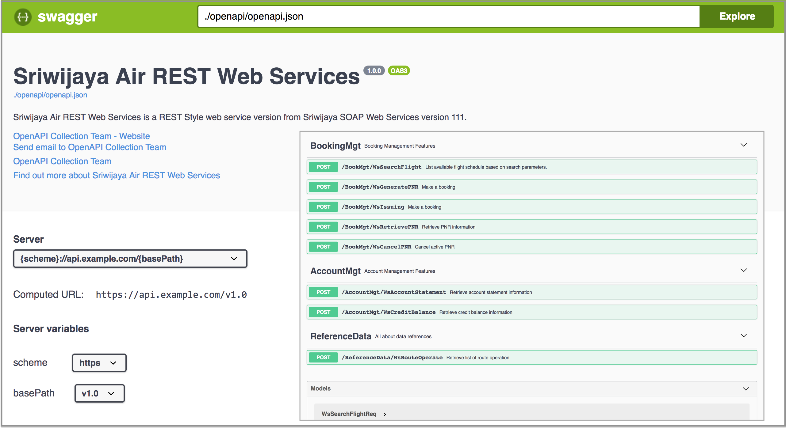

# Sriwijaya Air REST Web Services OpenAPI Specification

<p align="center">
  <a href="https://github.com/OpenAPICollection/sriwijaya-ws-openapi">
    
  </a>

  <h3 align="center">UnOfficial Sriwijaya Air REST Web Service OpenAPI Version</h3>

  <p align="center">
    Author:
    <br>
    <a href="https://github.com/OpenAPICollection"><strong>OpenAPI Collection Team »</strong></a>
    <br>
    <br>
    <a href="https://github.com/OpenAPICollection/sriwijaya-ws-openapi/issues">Report issues</a>
  </p>
</p>


#### Swagger UI

<p align="center">
  
</p>

##### Example

- [Swagger UI (sjopenapi111)](examples/sjopenapi111/swagger-ui/)

##### OpenAPI Specification

- [OpenAPI YAML Version (sjopenapi111)](sjopenapi111/openapi.yaml)

- [OpenAPI JSON Version (sjopenapi111)](sjopenapi111/openapi.json)


#### Repository Structure
```
.
└── sriwijaya-ws-openapi
    ├── LICENSE
    ├── README.md
    ├── examples
    │   └── sjopenapi111
    │       └── swagger-ui
    │           └── index.html
    └── sjopenapi111
        ├── openapi.json
        └── openapi.yaml

```

#### Credit
- [OpenAPI v 3.0.1](https://github.com/OAI/OpenAPI-Specification/blob/master/versions/3.0.1.md#specification)
- [Swagger UI](https://github.com/swagger-api/swagger-ui)