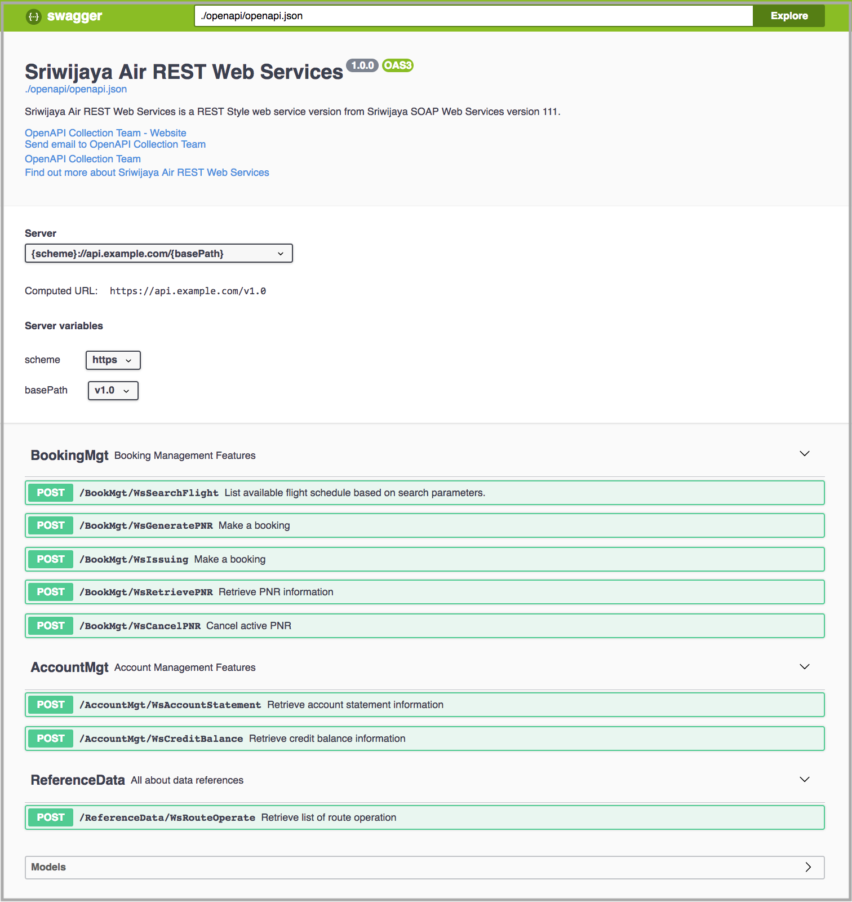

# Example: Swagger UI

## Prerequisites

- HTTP Server (All http server can be used for example: Apache, Nginx, http-server, etc)
    - http-server ([how to install](https://www.npmjs.com/package/http-server))

## Running example

- Running `http-server`

```bash
    $ cd <example sjopenapi111 swagger-ui path>
    $ http-server
    Starting up http-server, serving ./
    Available on:
        http:127.0.0.1:8080
```

- Open http-server URL with your favorite browser: [http://127.0.0.1:8080](http://127.0.0.1:8080)

<p align="center">
  
</p>
